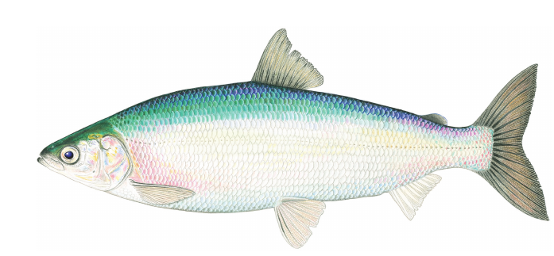
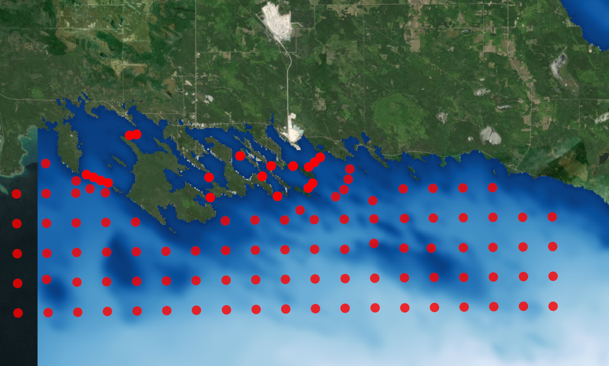

class: title-slide, center

# Tagging cisco: Lessons from the Les Cheneaux Islands

## Todd Hayden, Chris Holbrook

.center[]

	
	

---

class: top, center

# Acknowledgments

.left[
- Hammond Bay Biological Station
- Michigan Department of Natural Resources
- US Fish and Wildlife Service
- Real-Time Aquatic Ecosystem Observation Network
- Great Lakes Fishery Commission
- Great Lakes Acoustic Telemetry Observation System
]

.center[

]

---
class: top, center

# History

.left[
- 2017 field tagging trials (tagged few fish, Government Bay)
- 2018 preliminary project (28 receivers, 25 V9 tags)
- 2019-2021 full project (200 tags, 120 receivers)
- 2020 winter- tagging under ice (gill nets)
]

	
	

---
class: top, center

# Capture
.left[
- Nighttime electrofishing
  - Peak spawn- November 10-15
  - ~ 84% survival (6 months)
  - Tagged during peak spawn ~ 10-15' water 
  - Fish not available before/after spawning (too deep!)
]

.center[

]

---
class: top, center
# Capture
.left[
- Gill net 
  - Difficult or no recovery
  - Tried under ice gill nets, 20 minute soak, ~ 8% survival (6 months)
  - Lots of "rope burns"
]

.center[

]

---
class: top, center

# Post-capture care
.left[
- Goal: minimize handling time
- Capture 1-10 fish, transfer fish to waiting "transport boat" and
    Moved to shore
- Hold fish in flow-through .red[ROUND] tank (4') with .red[FLOW]
- Surgery immediately after fish "recovered" from electrofishing
]

.center[

]

---
class: top, center

# Surgery
.left[
- Tent, propane heater to prevent ice formation on fish and us!
- V9 tags, fish ~ 400 mm TL
- TENS electro mobilization
- <2 min surgery, 2 interrupted sutures
- Constant water flow over gills
]

	
	
	

---
class: top, center

# Recovery

.left[
- fish released as soon as swimming on own and able to maintain
orientation
- dedicated nurse- gently "assist" fish when upside down
  - upside down cisco needs immediate care to prevent death!
- cisco are finicky- some fish appeared dead in recovery but swam off
after release.
]

    
	

---
class: top, center

# Tanks and flow

.left[
- Round tanks with sufficient flow flow is critical
  - Rectangular/oval/cattle troughs result in "stuck fish"
- How much flow?
  - Fish should be swimming against current away from side ("endless
    pool")
  - Not enough water flow- fish turn over upside-down, die
  - Too much water flow- fish scrape tank sides
  - We used submersable utility pumps, short hoses and clamps to regulate
]

<video width="400" height="300" autoplay loop muted src="../images/tagged_cisco_recovery_sm.webm" type="video/webm">
</video>

---
class: top, center

# Take-home ideas

.left[
- Minimize handling, time in tanks
- Round tanks are critical
- Water flow
- TENs for electro immobilization- quick recovery
- release immediately after fish has regained ability to swim
]

.center[]
